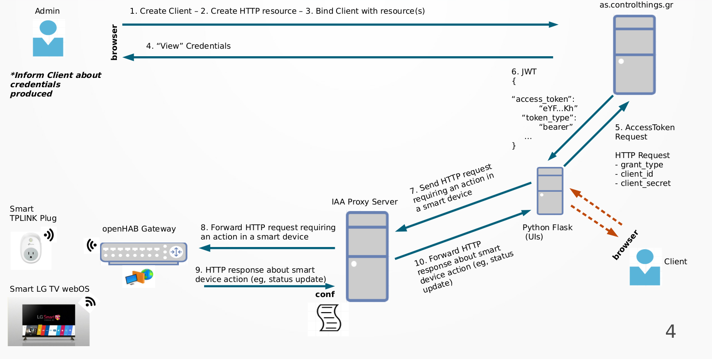

# SmartHomeGatewaySecurityFramework
openHAB authorization and authentication scheme delegating user's roles and allowing different access levels on Things. OAuth2.0 service and JWT (Json Web Token) are used as well as a python Proxy server for our proposed scenario. OAuth service is implemented by [ControlThings Server](https://as.controlthings.gr/) , an open source authorization server responsible for json web tokens generation. [Python Proxy Server](https://github.com/mmlab-aueb/identity-authentication-authorization) and [ControlThings Server](https://as.controlthings.gr/) are implemented and supported by [Nikos Fotiou](https://github.com/nikosft) (Researcher at AUEB).

## Proposed System Architecture



## Prerequisites

Tools and software you need to deploy project successfully. 
* **Operating System**<br>
The project has been build upon Ubuntu 20.04.01 LTS
* **Python v3.8**<br>
Python 3.7 or > v3.0 should be fine!
* **IDE**<br>
PyCharm 2020.2.1 (Community Edition)<br>
[Alternatively, any other IDE you want]

## Deploy Project

After setting up all essential tools, first, you have to do:
```sh
$ git clone https://github.com/stevpla/SmartHomeGatewaySecurityFramework.git
```
to download project at your space. Then move into project directory with:
```sh
$ cd SmartHomeGatewaySecurityFramework/openHABAccessControl/
```
and then there are three options to run the application.

```sh
1. Console-free without having continuous output logging on the terminal (nohup use)
  $ nohup python3.8 main.py &
2. Logging output on the terminal
  $ python3.8 main.py
3. Through IDE
```
### Deploy using only 2 python scripts (access_token_request.py for steps 5, 6 and http_resource_request.py for steps 7, 10)
Instead of running main.py, you can do the 2 steps using only the 2 python scripts. Each script has its own parameters. So:
```sh
$ python3.8 access_token_request.py <client_id> <client_secret>
$ python3.8 http_resource_request.py <json_token_file_path> <MY_HTTP_URL>
```


